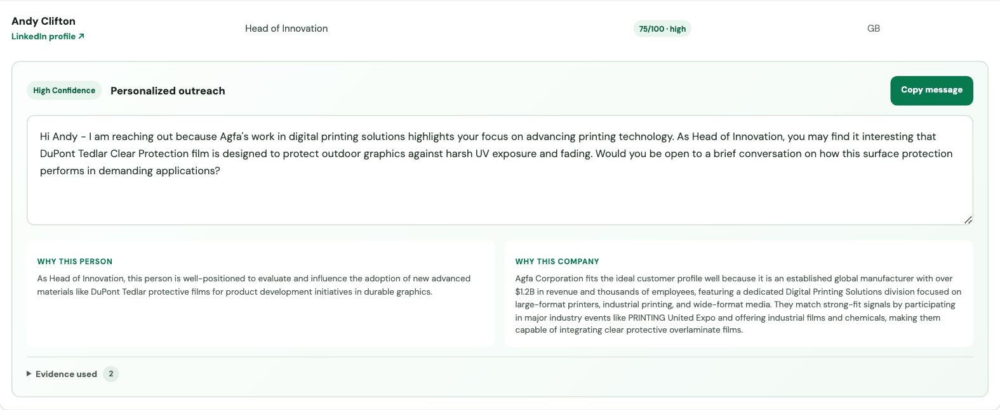

# Lead Generation and Outbound

An AI-assisted sales research workspace that turns an ideal customer profile (ICP) into a focused list of companies and people to contact.

The prototype was built for DuPont Tedlar's Graphics & Signage team. It:

1. Finds relevant industry events and trade shows.
2. Sources participating companies from event directories.
3. Enriches and qualifies those companies against the selected ICP.
4. Finds relevant decision-makers at high-fit companies.
5. Drafts personalized outreach messages for review.

The dashboard keeps the source evidence, qualification rationale, pipeline progress, and provider errors visible. Messages are editable and copyable, but the product does not send them automatically.



## Setup

### Prerequisites

- Node.js 20.9 or newer
- API keys for [Tavily](https://tavily.com/), [Apollo](https://www.apollo.io/), [Surfe](https://www.surfe.com/), and [Google Gemini](https://ai.google.dev/)

### 1. Install dependencies

```bash
npm install
npx playwright install chromium
```

Chromium is used to read event and exhibitor directories that render with JavaScript.

### 2. Configure API keys

Copy the example environment file:

```bash
cp .env.example .env
```

Then replace the placeholder values in `.env`:

```dotenv
TAVILY_API_KEY=your-tavily-key
APOLLO_API_KEY=your-apollo-key
SURFE_API_KEY=your-surfe-key
GOOGLE_GENERATIVE_AI_API_KEY=your-gemini-api-key
GOOGLE_GENERATIVE_AI_MODEL=gemini-3.5-flash-lite
```

The model setting is optional and can be changed without modifying the code.

### 3. Start the dashboard

```bash
npm run dashboard
```

Open [http://localhost:4173](http://localhost:4173). To use another port:

```bash
PORT=3000 npm run dashboard
```

In the dashboard, create or select an ICP and click **Run pipeline**. Results appear as each research stage completes.

## Useful commands

```bash
npm test          # Run backend tests
npm run test:e2e  # Build and test the main browser workflow
npm run typecheck # Check TypeScript types
npm run build     # Create a production build
npm start         # Serve the production build on port 4173
npm run db:inspect # Inspect saved pipeline runs
```

Pipeline results are stored locally in SQLite at `backend/prototypes/results/pipeline.sqlite`.

For implementation details and individual pipeline commands, see [backend/prototypes/README.md](backend/prototypes/README.md).
