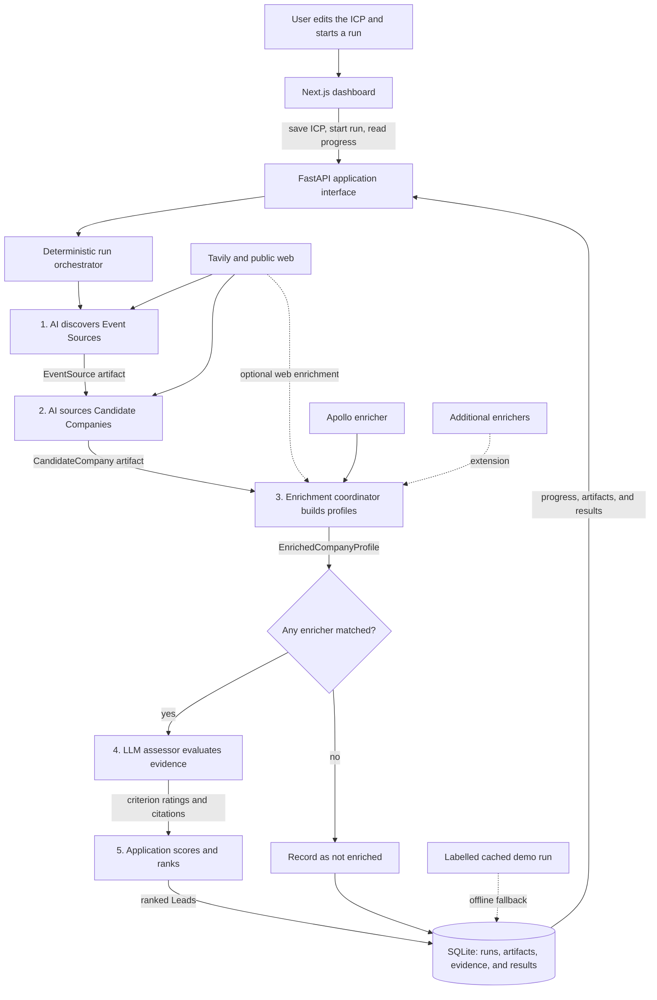
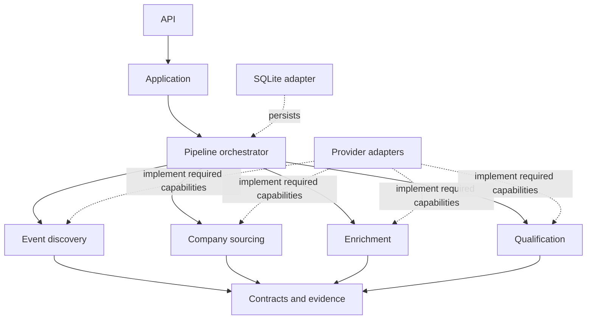

# Backend architecture overview

This document fixes the pipeline boundaries, stable contracts, and dependency direction for the prototype. Exact event selection, enrichment fields, and qualification criteria remain in their dedicated planning tickets.

## System flow



The orchestrator, not an AI agent, controls stage order, budgets, persistence, and failure handling. AI is bounded to discovery, sourcing, and evidence assessment tasks.

1. The application snapshots the active ICP and immediately returns a run identifier.
2. Event discovery finds and ranks relevant Event Sources using public-web evidence.
3. Company sourcing finds exhibitors, sponsors, speakers, or explicitly announced attendees and preserves the event evidence for each deduplicated Candidate Company.
4. The enrichment coordinator invokes configured enrichers and merges their claims into an Enriched Company Profile. Apollo is the first structured enricher, not the entire enrichment stage.
5. A company proceeds when at least one enricher successfully matches it. If every enricher returns `no_match` or `error`, the company is recorded as not enriched and is not assessed.
6. The assessor evaluates only the immutable profile and attached evidence. It cannot browse, retrieve more evidence, or send the company back through enrichment.
7. Application code validates the assessor output, maps bounded criterion ratings to configured weights, and calculates the final score and rank.
8. Decision-maker discovery and outreach drafting are future consumers of ranked Leads, not steps in company qualification.

## Runtime shape

The MVP is a modular monolith:

- Next.js dashboard
- FastAPI backend
- in-process background run executor
- SQLite persistence with validated JSON payloads

The dashboard starts a run, receives its identifier, and polls the application API for progress and results. A run writes an artifact after each completed stage. Interrupted runs retain completed artifacts but do not promise automatic or user-facing resume behavior. A developer can inspect or manually reuse those artifacts.

## Application interface

The application module is the only backend interface used by FastAPI. It exposes user workflows rather than providers or pipeline internals:

- read and update the active ICP
- start a run from an immutable ICP snapshot
- read run status, current stage, warnings, and provider usage
- list discovered Event Sources and Candidate Companies
- list ranked Leads
- read a Lead profile, assessment, and cited evidence
- list companies that could not be enriched and their provider outcomes

The interface does not expose Tavily, Apollo, prompts, correction retries, or storage details.

## Responsibility-based modules

```text
backend/
├── api/                 # FastAPI routes and transport schemas
├── application/         # Dashboard use cases and run queries
├── contracts/           # Stable Pydantic domain models
├── pipeline/            # Orchestration and stage artifacts
├── event_discovery/     # AI-grounded event discovery
├── company_sourcing/    # Event-to-company sourcing and deduplication
├── enrichment/          # Enricher coordination and profile merging
├── qualification/       # LLM assessment and deterministic scoring
├── evidence/            # Sources, claims, and provenance
├── persistence/         # SQLite implementation
└── providers/           # Tavily, Apollo, and LLM adapters
```

**ICP management** validates and persists the single editable ICP. Every run receives an immutable snapshot so later edits cannot change an active or historical run.

**Pipeline orchestration** owns stage order, fan-out across companies, budgets, artifact persistence, and partial-failure policy. Stages never call one another directly.

**Event discovery** turns an ICP snapshot into evidence-backed Event Sources. It owns query construction, extraction, relevance output, and source deduplication.

**Company sourcing** turns selected Event Sources into deduplicated Candidate Companies. It preserves which events and evidence led to each candidate.

**Enrichment** invokes one or more enrichers and merges their results. It validates company identity, records conflicts without silently discarding claims, and leaves missing fields as `unknown`.

**Qualification** submits an ICP, rubric, profile, and fixed evidence package to an assessor LLM. It validates structured responses and citations. It performs no retrieval and cannot mutate profiles or evidence.

**Deterministic scoring** maps assessor criterion ratings to rubric weights, calculates totals, and orders eligible companies. The LLM never supplies an unconstrained total score.

**Evidence** owns source records, extracted claims, and their links to selected profile fields. Evidence is persisted with run artifacts rather than hidden inside prompts or prose.

**Presentation** maps HTTP requests and responses to application use cases. It contains no discovery, enrichment, qualification, provider, or fallback decisions.

## Stable contracts

Use versioned Pydantic models whenever data crosses a module boundary.

### Core domain contracts

- `ICPSnapshot`
- `EventSource`
- `CandidateCompany`
- `EnrichedCompanyProfile`
- `SourceRecord`
- `EvidenceClaim`
- `QualificationAssessment`
- `Lead`
- `RunSnapshot`
- `StageArtifact`

A profile field references the claims supporting its selected value. A claim references the source from which it was extracted. This keeps retrieval, interpretation, and the canonical profile distinct and allows conflicting claims to remain visible.

### Provider and enrichment outcomes

Each configured enricher returns a provider-level result:

```text
ProviderResult = success | no_match | error
```

The enrichment coordinator combines those results:

```text
EnrichmentOutcome = enriched | not_enriched
```

Any `success` produces an `enriched` profile, even when some fields are unknown. A company is `not_enriched` only when every configured enricher returns `no_match` or `error`.

### Stage artifact

Every completed stage persists a common envelope with a stage-specific output:

```text
StageArtifact
├── run_id
├── stage
├── status
├── input_references
├── structured_output
├── evidence_references
├── warnings
├── provider_usage
├── started_at
└── completed_at
```

Ordinary partial results are represented in the artifact rather than raised as exceptions. Technical failures remain distinguishable from unknown business facts.

### Qualification assessment

```text
QualificationAssessment
├── company_id
├── rubric_version
├── model_version
├── prompt_version
├── criteria[]
│   ├── criterion_id
│   ├── rating
│   ├── rationale
│   ├── evidence_ids[]
│   └── missing_information[]
├── confidence
├── calculated_score
└── assessed_at
```

The assessor returns bounded criterion ratings, rationale, evidence citations, missing information, and confidence. Application code validates evidence IDs and calculates `calculated_score` from the versioned rubric.

The MVP uses one assessor. A future skeptical judge can review and replace the assessor's criterion decisions while consuming the same input and producing the same contract.

## LLM output validation

The backend derives JSON Schema from its Pydantic contracts and requests structured assessor output.

1. Validate the returned structure and referenced evidence IDs.
2. On structural failure, provide the validation errors to the model and request a corrected response.
3. Allow at most two correction attempts.
4. If validation still fails, mark that company's assessment as failed and continue the run.

Correction retries repair malformed output. They do not authorize the model to retrieve evidence or invent unsupported claims.

## Partial failures

Failures are isolated at the company level whenever possible:

- A failed or unmatched enricher does not fail a company if another enricher succeeds.
- A fully unenriched company skips qualification and remains visible as not enriched.
- A failed assessment excludes only that company from ranking.
- Missing profile data remains `unknown` and is not treated as negative evidence.
- The overall run may finish as `completed_with_warnings` when usable ranked results exist.
- A systemic failure in a required stage stops the run and retains all completed artifacts.

Skipped companies do not receive a score of zero because that would imply they were assessed and rejected.

## Persistence

SQLite is the MVP source of truth. Relational columns hold stable identifiers, statuses, and relationships. JSON columns hold validated stage-specific payloads, flexible claim values, and provider metadata. Raw provider responses remain separate from canonical profiles so changing an extraction rule does not rewrite source history.

Pydantic models, not the database engine, define module contracts. A future move to PostgreSQL JSONB should not change the domain model.

## Dependency rules



1. API routes depend only on application use cases.
2. Only the orchestrator moves artifacts between stages.
3. Stages depend on contracts and the narrow provider capabilities they require, not concrete SDKs.
4. Provider adapters contain transport and response-mapping logic, not domain decisions.
5. Provider-specific types stop at adapter boundaries.
6. Qualification receives evidence but cannot create, retrieve, or mutate it.
7. Contracts import no FastAPI, database, provider, or frontend types.
8. The dashboard accesses providers and persistence only through the application API.
9. Cached data uses the same contracts as live data and preserves its original retrieval time.

Avoid generic one-method repositories and a single universal provider interface. Add an adapter seam only where a dependency genuinely has multiple implementations or is external to the application.

## Testing responsibility

Testing is part of each module's completion criteria, not a separate implementation phase:

- Event discovery owns tests for structured discovery output and failures.
- Company sourcing owns tests for extraction, event provenance, and deduplication.
- Enrichment owns tests for provider outcomes, merging, conflicts, and unknown fields.
- Qualification owns tests for structured validation, evidence citations, correction retries, and score calculation.
- Persistence owns tests for round-tripping validated artifacts and evidence links.
- Pipeline orchestration owns the complete deterministic integration test from ICP snapshot to ranked Leads.
- Dashboard work owns the main browser workflow test.

Recorded provider responses and a labelled cached DuPont run keep automated tests deterministic. A live provider run is a manual smoke check rather than part of the normal suite.

## Deferred decisions

The following details remain with their dedicated wayfinding tickets:

- Event relevance, bounded selection, company extraction, and deduplication rules
- Enrichment fields, provider order, conflict selection, and cost limits
- Qualification criteria, rating vocabulary, weights, labels, and confidence semantics
- Dashboard presentation and progress interaction details
- Run budgets, cached-demo activation, and final lifecycle statuses
- Evaluation fixtures and observable demo acceptance criteria
